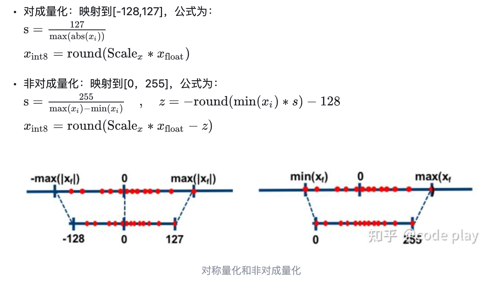
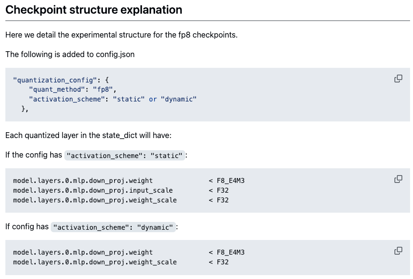

[AutoFP8 仓库](https://github.com/neuralmagic/AutoFP8)

AutoFp8 仓库的量化代码非常清晰和简洁，目前该仓库停止更新了，功能都迁移到了新的仓库（[llm-compressor](https://github.com/vllm-project/llm-compressor)），但是该仓库还是值得学习和使用的（容易使用，代码也清晰简单）。

# fp8 简介
fp8 的数值范围：e4m3： -448 到 448

# 对称量化和非对称量化

图虽然是 int8 的，但是 fp8 的原理是一样的。

# AutoFP8 动态量化
这里所说的动态，指的是激活值的量化是动态的，即激活值的 scale 每次重新计算得来的。(相当于量化过程中是 weight only 量化)

权重 weight 是静态的，即权重的 scale 提前计算好的。

对于 weight 的量化， autofp8 是使用 per-tensor 的量化方式，代码很简单，源码如下：
https://github.com/weishengying/AutoFP8/blob/main/auto_fp8/quantize.py#L34
```python
def per_tensor_quantize(tensor: torch.Tensor) -> Tuple[torch.Tensor, float]:
    """Quantize a tensor using per-tensor static scaling factor.
    Args:
        tensor: The input tensor.
    """
    finfo = torch.finfo(torch.float8_e4m3fn) # 获取浮点数的信息， finfo(float_info)
    # Calculate the scale as dtype max divided by absmax.
    # Since .abs() creates a new tensor, we use aminmax to get
    # the min and max first and then calculate the absmax.
    if tensor.numel() == 0:
        # Deal with empty tensors (triggered by empty MoE experts)
        min_val, max_val = (
            torch.tensor(-16.0, dtype=tensor.dtype),
            torch.tensor(16.0, dtype=tensor.dtype),
        )
    else:
        min_val, max_val = tensor.aminmax() #aminmax， along_min_max, 获取 tensor 在某个维度上的最大最小值
    amax = torch.maximum(min_val.abs(), max_val.abs())
    scale = finfo.max / amax.clamp(min=1e-12) # 这里限制了 scale 的最小值
    # scale and clamp the tensor to bring it to
    # the representative range of float8 data type
    # (as default cast is unsaturated)
    qweight = (tensor * scale).clamp(min=finfo.min, max=finfo.max) # 量化参数
    # Return both float8 data and the inverse scale (as float),
    # as both required as inputs to torch._scaled_mm
    qweight = qweight.to(torch.float8_e4m3fn) # 将数据类型转换为 float8，引入了截断误差
    scale = scale.float().reciprocal()
    return qweight, scale

```

量化完成后，使用 `FP8DynamicLinear` 替换 `torch.nn.Linear`，`FP8DynamicLinear` 推理时，需要先量化激活值，然后使用 fp8_gemm 进行运算，代码如下：
```python
# Class responsible for quantizing weights
class FP8DynamicLinear(torch.nn.Module):
    def __init__(
        self,
        weight: torch.Tensor,
        weight_scale: torch.Tensor,
        bias: torch.nn.Parameter,
    ):
        super().__init__()
        self.weight = torch.nn.Parameter(weight, requires_grad=False)
        self.weight_scale = torch.nn.Parameter(weight_scale, requires_grad=False)
        self.bias = bias

    def forward(self, x):
        qinput, x_scale = per_tensor_quantize(x) # 激活值的量化时动态的
        output = fp8_gemm(
            A=qinput,
            A_scale=x_scale,
            B=self.weight,
            B_scale=self.weight_scale,
            bias=self.bias,
            out_dtype=x.dtype,
        )
        return output
```
然后用 `FP8DynamicLinear` 替换模型中的 `torch.nn.Linear` 部分，如 q_proj, k_proj, v_proj 等。

# fp8_gemm
量化模型的推理性能也是重要的一环， AutoFp8 中使用了 fp8_gemm 来进行推理，源码中没有使用真正的 fp8_gemm，而是先反量化为 fp16，再使用 fp6_gemm 进行推理(相当于模拟量化)， 实际上也可以使用 torch 自带的 torch._scaled_mm() 进行 fp8 计算。具体可以查看 [scale_mm_example](scale_mm_example.py)
https://github.com/neuralmagic/AutoFP8/blob/main/auto_fp8/quantize.py#L70

> torch._scaled_mm(): 内部调用的是 cublas fp8 gemm, 要求输入A:（m， k）, 默认row major, 和 B:（k， n），col major == B:(n,k).t()

> Only multiplication of row-major and column-major matrices is supported by cuBLASLt

> 同时要求 k 和 n 能被 16 整除（应该是内部实现时为了更好的性能）

# 模型保存
这部分仓库里说的比较清楚：



# AutoFP8 static 量化
动态量化在原来的基础上，对输入 x 做 per tensor 量化，原理和量化 weight 一样。