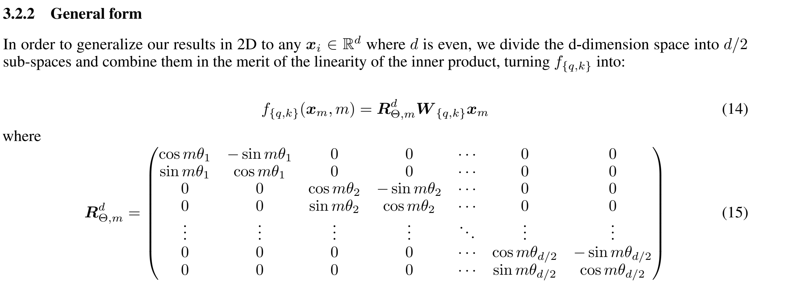
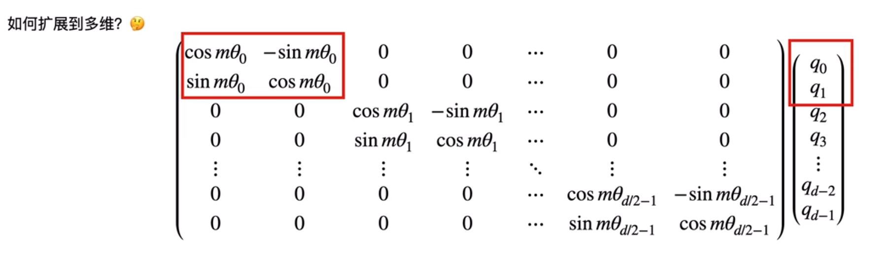
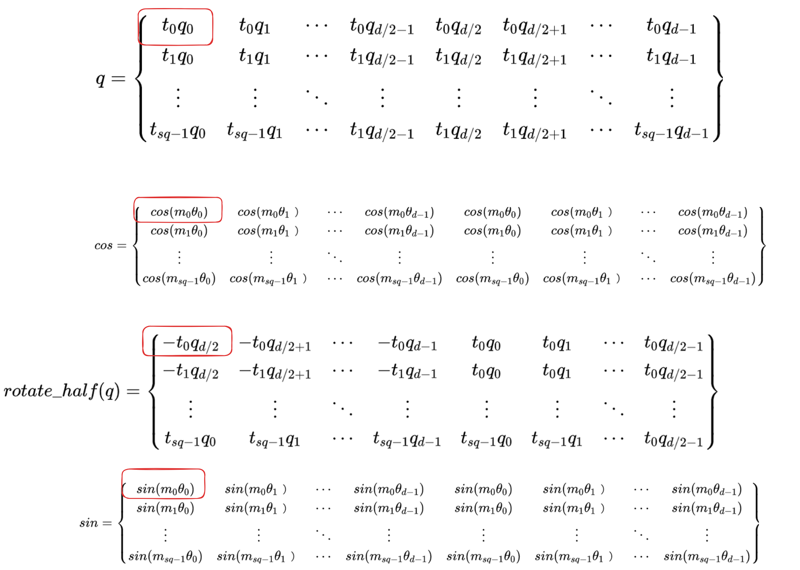
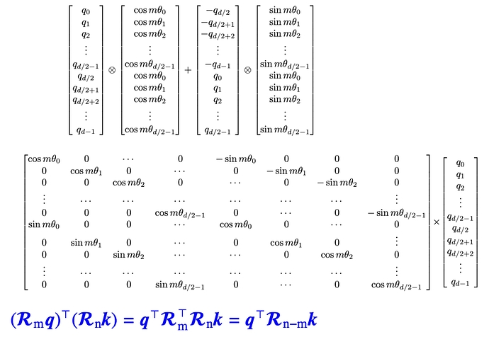
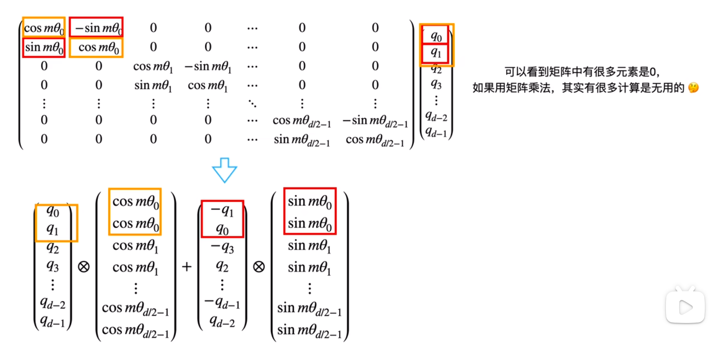
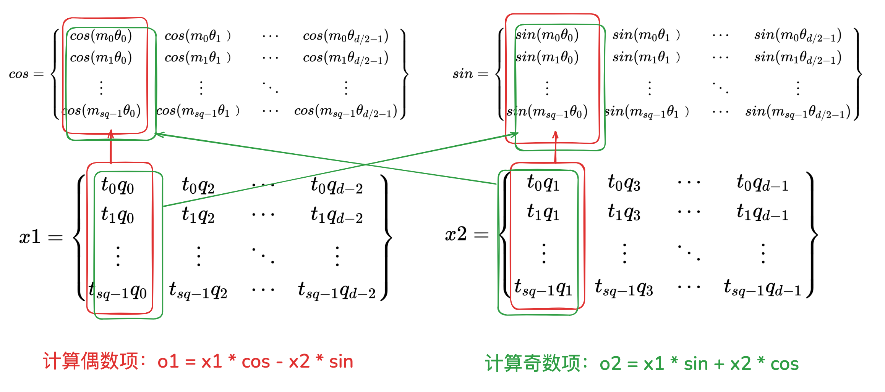

**参考**

本文主要参考了以下blog：

[一文看懂 LLaMA 中的旋转式位置编码（Rotary Position Embedding）](https://zhuanlan.zhihu.com/p/642884818)

[blibli视频：旋转位置编码rope](https://www.bilibili.com/video/BV1Mj421R7JQ/?spm_id_from=333.788.videopod.sections&vd_source=256dc78a15273aed9b1b4bce51d2a4a6)


旋转式位置编码（RoPE）最早是论文[ENHANCED TRANSFORMER WITH ROTARY
POSITION EMBEDDING](https://link.zhihu.com/?target=https%3A//arxiv.org/pdf/2104.09864.pdf)提出的一种能够将相对位置信息依赖集成到 self-attention 中并提升 transformer 架构性能的位置编码方式。而目前很火的 LLaMA 模型也是采用该位置编码方式。

接下来结合代码和论文来解读一下 RoPE。

## 基本概念
首先论文中定义一个长度为 $N$ 的输入序列为：

$$
S_N = \{w_i\}^N_{i=1}
$$

其中 `wi` 表示输入序列中的第 `i` 个 token， 而输入序列 `SN` 对应的 embedding 表示为：

$$
E_N = \{x_i\}^N_{i=1}
$$

其中 `xi` 表示第 `i` 个 token wi 对应的 d 维词嵌入向量。
接着在做 self-attention 之前，会用词嵌入向量计算 q, k, v 向量同时加入位置信息，函数公式表达如下：

$$
q_m = f_q(x_m, m)\\
k_n = f_k(x_n, n)\\
v_n = f_v(x_n, n)
$$

其中 qm 表示第 m 个 token 对应的词向量 xm 集成位置信息 m 之后的 query 向量。而 kn 和 vn 则表示第 n 个 token 对应的词向量 xn 集成位置信息 n 之后的 key 和 value 向量。

基于 transformer 的位置编码方法都是着重于构造一个合适的 f{q,k,v} 函数形式。

计算第 m 个词嵌入向量 xm 对应的 self-attention 输出结果，就是 qm 和其他 kn 都计算一个 attention score ，然后再将 attention score 乘以对应的 vn 再求和得到输出向量 om：

$$
a_{m,n} = \frac{exp(\frac{q_m^Tk_n}{\sqrt{d}})}{\sum^N_{j=1}exp(\frac{q_m^Tk_j}{\sqrt{d}})}
$$

## 绝对位置编码
对于位置编码，常规的做法是在计算 query, key 和 value 向量之前，会计算一个位置编码向量 pi 加到词嵌入 xi 上，位置编码向量 pi 同样也是 d 维向量，然后再乘以对应的变换矩阵 W{q,k,v}：
$$
f_{q,k,v}(x_i, i) = W_{q,k,v} \cdot (x_i + pi_i)
$$
而经典的位置编码向量 pi 的计算方式是：
$$
p_{i,2t} = sin(\frac{i}{10000^{\frac{2t}{d}}})\\
p_{i,2t+1} = cos(\frac{i}{10000^{\frac{2t}{d}}})
$$
其中 p_{i,2t} 表示位置 d 维度向量 pi 中的第 2t 位置分量也就是偶数索引位置的计算公式，而 p_{i,2t+1} 就对应第 2t+1 位置分量也就是奇数索引位置的计算公式。

## 旋转式位置编码
接着论文中提出为了能利用上 token 之间的相对位置信息，假定 query 向量 qm 和 key 向量 kn 之间的内积操作可以被一个函数 g 表示，该函数 g 的输入是词嵌入向量 xm ， xn 和它们之间的相对位置 m - n：
$$
<f_q(x_m, m), f_k(x_n, n)> = g(x_m, x_n, m - n)
$$
接下来的目标就是找到一个等价的位置编码方式，从而使得上述关系成立。
假定现在词嵌入向量的维度是两维 d=2，这样就可以利用上2维度平面上的向量的几何性质，然后论文中提出了一个满足上述关系的 f 和 g 的形式如下：
$$
f_q(x_m, m) = (W_qx_m)e^{im\theta}\\
f_k(x_n, n) = (W_kx_n)e^{im\theta}\\
g(x_m, x_n, m-n) = Re[(W_qx_m)(W_kx_n)^*e^{i(m-n)\theta}]
$$

原博客后面给出了，当 embedding 词向量维度为 2 时，上述公式的成立的证明。证明过程不难，这里忽略，后面主要讨论实际的应用和具体的代码实现。

已知 $f_q(x_m, m) = (W_qx_m)e^{im\theta} = q_me^{im\theta}$， 注意 qm 假设的是为 2 维向量，将 qm 写成复数形式，并使用欧拉公式展开后面一项：

$$
q_me^\theta=(q_m^{(1)} + iq_m^{(2)})*(cos(m\theta) + isin(m\theta))\\
= q_m^{(1)}cos(m\theta) - q_m^{(2)}sin(m\theta) + i(q_m^{(1)}sin(m\theta) + q_m^{(2)}cos(m\theta))
$$

将上述结果重新表达为实数的向量形式：

$$
f_q(x_m, m) = [q_m^{(1)}cos(m\theta) - q_m^{(2)}sin(m\theta), q_m^{(2)}cos(m\theta) + q_m^{(1)}sin(m\theta)] \\
=\left(
\begin{array}{c}
\text{$cos(m\theta)$} \\
\text{$sin(m\theta)$}
\end{array}
\right.
\quad
\left.
\begin{array}{c}
\text{$-sin(m\theta)$} \\
\text{$cos(m\theta)$}
\end{array}
\right)
\left(
\begin{array}{c}
\text{$q_m^{(1)}$} \\
\text{$q_m^{(2)}$}
\end{array}
\right)
$$

$f_k(x_n, n)$ 也是一样的方式。
可以看出，如果词向量是二维的，就可以使用这种方式来给 query 和 key 添加旋转位置编码。但是实际的 query 向量不止二维（实际是 head_dim 维），所以需要将 query 向量拆分成多个二维向量，每个二维向量都使用上述公式进行旋转位置编码。

这里直接放上论文里的片段。





其中$\theta_i = 10000 ^\frac{-2(i-1)}{d}, i \in [1, 2, ..., d/2]$

## 计算优化
矩阵里很多元素是0，如果直接用矩阵乘法，其实有很多计算是无用的，因此可以做如下的优化。


## 代码实现
### transformers 实现
完整代码见 [tf_rot.py](./tf_rot.py)，下面解读一些代码中的重要片段。
```python
inv_freq = 1.0 / (self.base ** \
        (torch.arange(0, self.dim, 2, dtype=torch.int64) \
        .float().to(device) / self.dim))
        # [head_dim / 2] 
```
这里就是计算 $\theta_i = 10000 ^\frac{-2(i-1)}{d}, i \in [1, 2, ..., d/2]$， 等价于：
$$
\theta_i = 1/ (10000 ^\frac{2i}{d}), i \in [0, 2, ..., d-2]
$$
m 是位置信息，从 0 到 seq_len - 1, 因此结下来需要计算:
$$
m_0\theta_0, ..., m_0\theta_{d/2-1}, m_1\theta_0, ..., m_1\theta_{d/2-1}, ..., m_{seq\_len-1}\theta_0, ..., m_{seq\_len-1}\theta_{d/2-1}
$$ 
使用一个矩阵乘法即可完成，即代码中的：
```python
freqs = (inv_freq_expanded.float() @ position_ids_expanded.float()).transpose(1, 2) 
#[bs, seq_len, head_dim / 2]]
```
$$
\left\{
\begin{array}{cccc}
m_0\theta_{0} & m_0\theta_{1} & \cdots & m_0\theta_{d/2-1} \\
m_1\theta_{0} & m_1\theta_{1} & \cdots & m_1\theta_{d/2-1} \\
\vdots & \vdots & \ddots & \vdots \\
m_{sq-1}\theta_{0} & m_{sq-1}\theta_{1} & \cdots & m_{sq-1}\theta_{d/2-1}
\end{array}
\right\}
$$

然后 cat 一下，求 cos， sin。
```python
emb = torch.cat((freqs, freqs), dim=-1)
cos = emb.cos() # [bs, seq_len, head_dim]
sin = emb.sin() # [bs, seq_len, head_dim]
```
$$
cos = 
\left\{
\begin{array}{cccccccc}
cos(m_0\theta_{0}) & \cdots & cos(m_0\theta_{d-1}) & cos(m_0\theta_{0}) & \cdots & cos(m_0\theta_{d-1}) \\
cos(m_1\theta_{0}) & \cdots & cos(m_1\theta_{d-1}) & cos(m_1\theta_{0}) & \cdots & cos(m_1\theta_{d-1}) \\
\vdots  & \ddots & \vdots & \vdots  & \ddots & \vdots\\
cos(m_{sq-1}\theta_{0}) & \cdots & cos(m_{sq-1}\theta_{d-1}) & cos(m_{sq-1}\theta_{0}) & \cdots & cos(m_{sq-1}\theta_{d-1})
\end{array}
\right\},
$$

$$
sin = 
\left\{
\begin{array}{cccccccc}
sin(m_0\theta_{0}) & \cdots & sin(m_0\theta_{d-1}) & sin(m_0\theta_{0}) & \cdots & sin(m_0\theta_{d-1}) \\
sin(m_1\theta_{0}) & \cdots & sin(m_1\theta_{d-1}) & sin(m_1\theta_{0}) & \cdots & sin(m_1\theta_{d-1}) \\
\vdots & \ddots & \vdots & \vdots & \ddots & \vdots\\
sin(m_{sq-1}\theta_{0}) & \cdots & sin(m_{sq-1}\theta_{d-1}) & sin(m_{sq-1}\theta_{0} & \cdots & sin(m_{sq-1}\theta_{d-1})
\end{array}
\right\}
$$

最后按照下面方式计算：
```python
q_embed = (q * cos) + (rotate_half(q) * sin)
```

$$
q = 
\left\{
\begin{array}{cccccccc}
t_0q_0 & t_0q_1& \cdots & t_0q_{d/2-1} & t_0q_{d/2} & t_0q_{d/2+1} & \cdots & t_0q_{d-1}\\
t_1q_0 & t_1q_1& \cdots & t_1q_{d/2-1} & t_1q_{d/2} & t_1q_{d/2+1} & \cdots & t_1q_{d-1}\\
\vdots & \vdots & \ddots & \vdots & \vdots & \vdots & \ddots & \vdots\\
t_{sq-1}q_0 & t_{sq-1}q_1 & \cdots & t_1q_{d/2-1} & t_1q_{d/2} & t_1q_{d/2+1} & \cdots & t_{sq-1}q_{d-1}
\end{array}
\right\}
$$

$$
r(q) =
\left\{
\begin{array}{cccccccc}
-t_0q_{d/2} & -t_0q_{d/2+1} & \cdots & -t_0q_{d-1} & t_0q_0 & t_0q_1& \cdots & t_0q_{d/2-1} \\
-t_1q_{d/2} & -t_1q_{d/2+1} & \cdots & -t_1q_{d-1} & t_1q_0 & t_1q_1& \cdots & t_1q_{d/2-1}\\
\vdots & \vdots & \ddots & \vdots & \vdots & \vdots & \ddots & \vdots\\
-t_1q_{d/2} & -t_1q_{d/2+1} & \cdots & -t_{sq-1}q_{d-1} & t_{sq-1}q_0 & t_{sq-1}q_1 & \cdots & t_1q_{d/2-1} 
\end{array}
\right\}
$$

我们用一个示意图来表述这种运算：



简化的图形就是：



这种实现和论文里的不等。

### vllm 的实现
见代码 [vllm_rot.py](./vllm_rot.py)

$\theta_i = 10000 ^\frac{-2(i-1)}{d}, i \in [1, 2, ..., d/2]$ 的计算是一样的：
```python
def _compute_inv_freq(self, base: Union[int, float]) -> torch.Tensor:
        """Compute the inverse frequency."""
        inv_freq = 1.0 / (base**(torch.arange(
            0, self.rotary_dim, 2, dtype=torch.float) / self.rotary_dim))
        return inv_freq
```

$cos(m\theta_i),sin(m\theta_i)$ 的计算， vllm 直接根据最大位置，提前全部算好，计算过程中根据实际的输入长度取出对应的部分即可：
```python
def _compute_cos_sin_cache(self) -> torch.Tensor:
        """Compute the cos and sin cache."""
        inv_freq = self._compute_inv_freq(self.base) #[rotary_dim / 2]

        # [max_position_embeddings]
        t = torch.arange(self.max_position_embeddings, dtype=torch.float) 
        
        # [max_position_embeddings, rotary_dim / 2]
        freqs = torch.einsum("i,j -> ij", t, inv_freq) 
        
        cos = freqs.cos()
        sin = freqs.sin()
        cache = torch.cat((cos, sin), dim=-1)
        return cache
```
同样得到如下的tensor：
$$
cos = 
\left\{
\begin{array}{cccc}
cos(m_0\theta_{0}) & cos(m_0\theta_{1}) & \cdots & cos(m_0\theta_{d/2-1})   \\
cos(m_1\theta_{0}) & cos(m_1\theta_{1}) & \cdots & cos(m_1\theta_{d/2-1}) \\
\vdots & \vdots & \ddots & \vdots \\
cos(m_{sq-1}\theta_{0}) & cos(m_{sq-1}\theta_{1}) & \cdots & cos(m_{sq-1}\theta_{d/2-1}) 
\end{array}
\right\}\\
$$

$$
sin = 
\left\{
\begin{array}{cccc}
sin(m_0\theta_{0}) & sin(m_0\theta_{1}) & \cdots & sin(m_0\theta_{d/2-1})  \\
sin(m_1\theta_{0}) & sin(m_1\theta_{1}) & \cdots & sin(m_1\theta_{d/2-1})  \\
\vdots & \vdots & \ddots & \vdots \\
sin(m_{sq-1}\theta_{0}) & sin(m_{sq-1}\theta_{1}) & \cdots & sin(m_{sq-1}\theta_{d/2-1})
\end{array}
\right\}
$$

然后是计算，对照下面这个图逻辑计算。



vllm 中先对 x 进行的了分割切片，分割出偶数项，奇数项，然后分别和sin cos计算，最后拼接起来。
```python
#[num_tokens, num_heads, head_size / 2], 每隔一个数取一个，即偶数项
x1 = x[..., ::2]  
#[num_tokens, num_heads, head_size / 2]，奇数项
x2 = x[..., 1::2] 
o1 = x1 * cos - x2 * sin
o2 = x2 * cos + x1 * sin
# [num_tokens, num_heads, head_size]
return torch.stack((o1, o2), dim=-1).flatten(-2) 
```

计算逻辑示意图如下：



vllm的实现和论文里的相同!