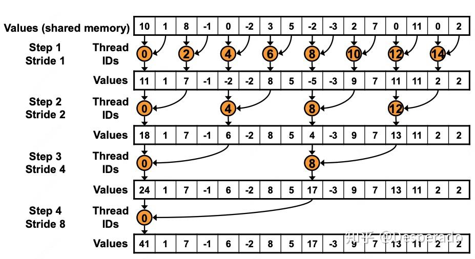

# reduce
参考博客

https://zhuanlan.zhihu.com/p/711961385

https://zhuanlan.zhihu.com/p/426978026

代码：
https://github.com/Liu-xiandong/How_to_optimize_in_GPU/blob/master/reduce/README.md


## reduce_0_naive
算法思路：

> 输入是一个长度为 N 的向量
> 
算法对应的示意图如下：（这种算法要求输入 N 是 2 的幂数， 如果不是， 可以在后面补0， 增长为 2 的幂）


Thread_per_block 一般取 256。

每个 block 处理 Thread_per_block 个元素， 一共 N / Thread_per_block 个 block，即有 N 个线程，每个线程负责处理一个元素。

```c++
__global__ void reduce_0_naive(float* input, int N, float* res) {
    int idx = blockIdx.x * blockDim.x + threadIdx.x;
    int tid = threadIdx.x;

    // each thread load an element
    __shared__ float smem[THREAD_PER_BLOCK];
    
    smem[tid] = smem[idx];
    __syncthreads();

    for(int i = 1; i < THREAD_PER_BLOCK; i = i *2) {
        if(tid % (i * 2) == 0) {
            smem[tid] += smem[tid + i];
        }
        __syncthreads();
    }
    // write result for this block to global mem
    if(tid == 0) res[blockIdx.x] = smem[tid];
}
```

## 优化1：线程束分化： reduce_1_warp_no_divergence
让 warp 内的 divergent 变为 warp 间的 divergent。简单计算一下，256个线程，warp size 为32，就有 8 个 warp。第一轮迭代，warp0,warp1,warp2,warp3进入分支计算求和，warp4,warp5,warp6,warp7 什么也不干(记住这里)。第二轮迭代，warp0,warp1,进入分支计算，warp2和warp3啥也不干，后续 warp0 进入计算，接着 warp0 内前 16 个线程进入计算，以此类推。


```c++
__global__ void reduce_1_warp_no_divergence(float* input, float* res) {
    // each thread load an element to smem
    __shared__ float smem[THREAD_PER_BLOCK];
    int idx = threadIdx.x + blockIdx.x * blockDim.x;
    int tid = threadIdx.x;
    smem[tid] = input[idx];
    __syncthreads();

    for(int i = 1; i < THREAD_PER_BLOCK; i *= 2) {
        int x = 2 * tid * i;
        if(x < THREAD_PER_BLOCK) {
            smem[x] += smem[x + i];
        }
        __syncthreads();
    }

    if(tid == 0) res[blockIdx.x] = smem[0];
}
```


# 优化2: 解决 bank 冲突
一个 warp 内， 不同 thread 访问同一个 bank 内存（shared mem）， 会导致 bank 冲突。
让同一个 warp 内的线程，访问不同的 32 个bank 即可。算法逻辑如下：


```c++
__global__ void reduce_2_warp_no_bank_conflict(float* input, float* res) {
    // load data to smem
    __shared__ float smem[THREAD_PER_BLOCK];
    int idx = threadIdx.x + blockIdx.x * blockDim.x;
    int tid = threadIdx.x;
    smem[tid] = input[idx];
    __syncthreads();

    for(int i = THREAD_PER_BLOCK / 2; i > 0; i >>= 1) {
        if(tid < i)
            smem[tid] = smem[tid] + smem[tid + i];
        __syncthreads();
    }

    if(tid == 0)
        res[blockIdx.x] = smem[0];
}
```


# 优化3: 提高线程使用率：
reduce_2_warp_no_bank_conflict 中每一次迭代有一半的线程不干活。而且，128-255号线程最过分，除了 load 数据之外没有任何贡献，啥也不干。想来想去，能不能让它们干点活呢。想来想去，那这样吧，让它好歹做一次加法。除了去global memory中取数外，再做一次加法。当然为了实现这个，block数就得改一改了。Block数量减少，Num_per_block增加一倍。也就是说原来一个block只需要管256个数就行，现在得管512个数了。加法完成了之后， 一个 block 也只需要管 256 个数就行了，所以 for 循环里面的代码不变。

我们要将block num减少一半，const int NUM_OF_BLOCK = (input_size+THREAD_PER_BLOCK*2-1)/ (THREAD_PER_BLOCK*2);。在loop循环之前先让thread做一次计算，也算物尽其用。

```c++
__global__ void reduce_3_add_when_loading(float* input, float* res) {
    // load data to smem
    __shared__ float smem[THREAD_PER_BLOCK];
    int idx = threadIdx.x + 2 * blockIdx.x * blockDim.x;
    int tid = threadIdx.x;
    smem[tid] = input[idx] + input[idx + blockDim.x];
    __syncthreads();

    for(int i = THREAD_PER_BLOCK / 2; i > 0; i >>= 1) {
        if(tid < i)
            smem[tid] = smem[tid] + smem[tid + i];
        __syncthreads();
    }

    if(tid == 0)
        res[blockIdx.x] = smem[0];
}
```

当然也可以 load 多个元素：
```c++
// constexpr int num_blocks = N / threads_per_block / add_when_loading;
__global__ void reduce_3_add_when_loading_2(float* arr, int n, float* res) {
    int idx = blockIdx.x * blockDim.x + threadIdx.x;
    int tid = threadIdx.x;
    
    __shared__ float smem[THREAD_PER_BLOCK];

    smem[tid] = 0.f;
    for (int i = 0; i < ADD_WHEN_LOADING; ++i) {
        smem[tid] += arr[idx + i];
    }
    __syncthreads();

    for (int i = THREAD_PER_BLOCK / 2; i >= 1; i >>= 1) {
        if (tid < i) {
            smem[tid] += smem[tid + i];
        }
        __syncthreads();
    }

    if (tid == 0) {
        res[blockIdx.x] = smem[0];
    }
}
```

# 优化4: warp内展开：减少同步开销
由于一个 warp 中的32个线程其实是在一个 SIMD 单元上，这 32 个线程每次都是执行同一条指令，这天然地保持了同步状态，因而当 s=32 时，即只有一个 SIMD 单元在工作时，完全可以将 __syncthreads() 这条同步代码去掉。所以我们将最后一维进行展开以减少同步。伪代码如下：

```cpp
__global__ void reduce_4_lool_unrolling(float* input, float* res) {
    // load data to smem
    __shared__ float smem[THREAD_PER_BLOCK];
    int idx = threadIdx.x + 2 * blockIdx.x * blockDim.x;
    int tid = threadIdx.x;
    smem[tid] = input[idx] + input[idx + blockDim.x];
    __syncthreads();

    for(int i = THREAD_PER_BLOCK / 2; i > 32; i >>= 1) {
        if(tid < i)
            smem[tid] = smem[tid] + smem[tid + i];
        __syncthreads();
    }

    if (tid < 32) { // 到这里，block 中只剩第一个 warp 中的线程需要工作
        warp_reduce(buffer, tid);
    }

    if(tid == 0)
        res[blockIdx.x] = smem[0];
}
```
# 优化5: 使用 shuffle 原语操作
Shuffle 指令是一组针对 warp 的指令。Shuffle 指令最重要的特性就是 warp 内的寄存器可以相互访问。在没有 shuffle 指令的时候，各个线程在进行通信时只能通过 shared memory 来访问彼此的寄存器。而采用了shuffle 指令之后，warp 内的线程可以直接对其他线程的寄存器进行访存。通过这种方式可以减少访存的延时。除此之外，带来的最大好处就是可编程性提高了，在某些场景下，就不用shared memory了。毕竟，开发者要自己去控制 shared memory还是挺麻烦的一个事。

```cpp
template<unsigned int N>
__device__ __forceinline__ float warp_reduce_sum(float sum) {
    //shuffle原语允许一个warp内的线程直接交换寄存器中的数据，而不需要经过共享内存
    // thread16将sum值传递给thread0,此时thread0的值为sum(本身)+sum(thread16)
    //最后warp内所有的sum全都累加到thread0上
    if(N >= 32) sum += __shfl_down_sync(0xffffffff, sum, 16);
    if(N >= 16) sum += __shfl_down_sync(0xffffffff, sum, 8);
    if(N >= 8) sum += __shfl_down_sync(0xffffffff, sum, 4);
    if(N >= 4) sum += __shfl_down_sync(0xffffffff, sum, 2);
    if(N >= 2) sum += __shfl_down_sync(0xffffffff, sum, 1);
    return sum;
}


__global__ void reduce_sum_kernel(float* input, float* res) {
    float sum = 0;
    int idx = threadIdx.x + blockIdx.x * blockDim.x;
    int tid = threadIdx.x;
    sum = input[idx];
    __syncthreads();

    // reduce in warp
    sum = warp_reduce_sum<THREAD_PER_BLOCK>(sum); //这里以 warp 为粒度做 reduce sum

    __shared__ float warp_reduce_sum_buffer[THREAD_PER_BLOCK/32];
    int lane_id = tid & 0x1f;
    int warp_id = tid >> 5;

    if (lane_id == 0)
        warp_reduce_sum_buffer[warp_id] = sum; 
    __syncthreads();

    // 把不同 warp 的 lane_id=0 的数据（即该 warp 内的 sum）放到一个warp内。tid为前 8 个才有sum
    // 即前 8 个线程从 smem 中读取数据
    sum = tid < THREAD_PER_BLOCK/32 ? warp_reduce_sum_buffer[lane_id] : 0;
    
    // 第一个 warp 再做一个 warp 内的 reduce
    if(warp_id == 0)
        sum = warp_reduce_sum<THREAD_PER_BLOCK/32>(sum);

    if(tid == 0)
        res[blockIdx.x] = sum;
}
```