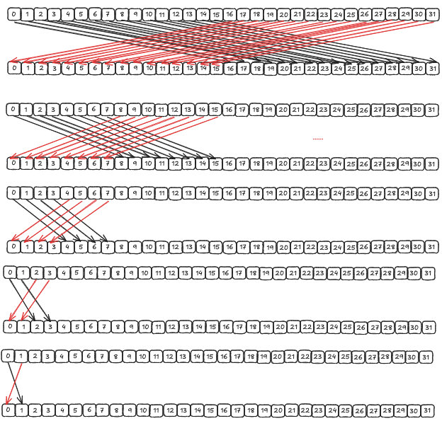

# softmax
假设向量 $Z={z_1,z_2,...,z_i,..z_k}$， 则 softmax 的公式为：
$$
Softmax(z_i) = \frac{e^{z_i}}{\sum_{j=1}^{K} e^{z_j}}
$$

softmax 的公式如上，但是这是不安全的 softmax，因为当 $z_i$ 过大时，$e^{z_i}$ 的累加可能会产生数值溢出，所以需要使用以下公式：
$$
d = max(Z)
$$
$$
Softmax(z_i) = \frac{e^{z_i-d}}{\sum_{j=1}^{K} e^{z_j-d}}
$$
根据指数除法的性质，二者是等价的。

# cpu 上的计算
见 [softmax.cu](softmax.cu) 中的 softmax_cpu 函数

# cuda
见 [softmax.cu](softmax.cu) 中的 softmax_cpu 函数

# 关于 shuffle 指令
参考博客：https://zhuanlan.zhihu.com/p/669957986

线程束内的规约操作，往往可以使用 shuffle 指令，如 __shfl_xor_sync(), 如下面代码：
```c++
template<T>
struct ADD{
    __device__ __forceinline__ T operator()(const T& x, const T& y) {
        return x + y;
    }
}

template<T>
struct MAX{
    __device__ __forceinline__ T operator()(const T& x, const T& y) {
        return x > y ? x : y;
    }
}

template<typename T, int REDUCE_SIZE, template<typename> class Op>
__device__ __forceinline__ T warp_reduce(T val){
    for(int i = REDUCE_SIZE / 2; i >= 1; i >> 1) {
        val = Op<T>()(val, __shfl_xor_sync(0xffffffff, val, i));
    }
    return val;
}
```
对应的示意图如下：

以 reduce sum 为例，
第一次循环，把后面的 16 个数，加到前面 16个数中去，第二次， 把后面的 8 个数加到前面 8 个数中去，以此类推，完成规约操作。最后，warp 中每个线程都得到了最后的sum