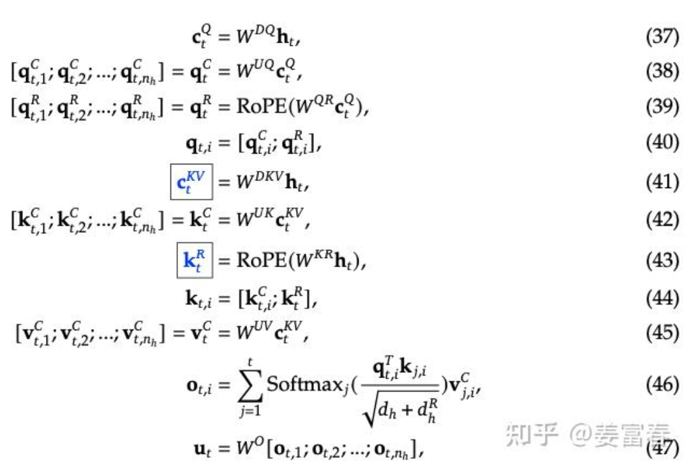
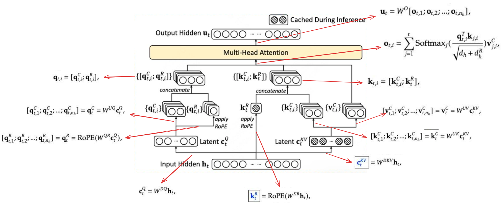

deepseek v3中：
$C_t^{KV} 的维度 d_c = 512$, c 是 conpress 的缩写，即压缩后的 k v 的 
headim 为 512；

$n_h$ 即 num_head, $v_{t,i}^C$的维度为 head_dim($d_h$), 所以 $\{v_{t,i}^C\}$的维度就是 num_head * head_dim ($d_hn_h$)

$d_c << d_hn_h$ , 计算流程对应的伪代码如下：

```python
## Extent Definitions:
Sq      as Q sequence length
Skv     as KV sequence length

C           Context length, `Skv - Sq`
H           hidden size
N           number of attention heads
Lq          latent dimension for Q              1536 in DSV3
Lkv         latent dimension for K/V            512 in DSV3
P           nope dimension, no rope.            128 in DSV3
R           rope dimension, goes through rope.  64 in DSV3
V           V head dim.                         128 in DSV3

## Vector/Matrix Definitions

h_t         hidden states (input to attention)  shape [Sq, H]
q_c         latent/compressed Q                 shape [Sq, Lq]
q_nope      uncompressed Q (no-rope)            shape [Sq, N, P]
q_pe        uncompressed Q (rope)               shape [Sq, N, R]
kv_c        latent/compressed KV                shape [Skv, Lkv]
k_pe        decoupled k position embeddings     shape [Skv, R]
new_kv_c    new kv_c from current iter          shape [Sq, Lkv]
new_k_pe    new k_pe from current iter          shape [Sq, R]
cache_kv_c  cached k_c from previous iters      shape [C, Lkv]
cache_k_pe  cached k_pe from previous iters     shape [C, R]
W_DQ        project h_t to q_c                  shape [H, Lq]
W_UQ        project q_c to q_nope               shape [Lq, N * P]
W_QR        project q_c to q_pe                 shape [Lq, N * R]
W_DKV       project h_t to kv_c                 shape [H, Lkv]
W_UK        project kv_c to k_nope              shape [Lkv, N * P]
W_KR        project h_t to k_pe                 shape [H, N * R]
W_UV        project kv_c to v                   shape [Lkv, N * V]
W_O         project v to h_t                    shape [N * V, H]

## Compute Friendly Approach (i.e. "_forward_prefill"):
## prefill阶段 C == Sq == Skv
q_c      = h_t @ W_DQ  #[Sq, Lq] = [Sq, H] * [H, Lq]
q_nope   = (q_c @ W_UQ).view(Sq, N, P) #[Sq, Lq] * [Lq, N * P]
q_pe     = RoPE(q_c @ W_QR).view(Sq, N, R) #[Sq, Lq] * [Lq, N * R]
new_kv_c = h_t @ W_DKV #[Sq, Lkv] = [Sq, H] * [H, Lkv]
new_k_pe = RoPE(h_t @ W_KR) #[Sq, R] = [Sq, H] * [H, N * R]
kv_c     = torch.cat([new_kv_c, cache_kv_c], dim=0) #[C, Lkv]
k_pe     = torch.cat([new_k_pe, cache_k_pe], dim=0) #[C, R]
k_nope   = (kv_c @ W_UK).view(Skv, N, P) #[Skv, N * P] = [C, Lkv] * [Lkv, N * P]
v        = (kv_c @ W_UV).view(Skv, N, V) #[Skv, N * P] = [C, Lkv] * [Lkv, N * V]

// MHA with QK headdim = P + R # v3中 128 + 64
//           V headdim = V # v3中 128，需要 pad 到和 qk 相同
//      spda_o shape [Sq, N, V]
spda_o = scaled_dot_product_attention(
    torch.cat([q_nope, q_pe], dim=-1),
    torch.cat([k_nope, k_pe.unsqueeze(1).expand(-1, N, -1)], dim=-1),
    v
) 
return spda_o @ W_O

## Data-Movement Friendly Approach (i.e. "_forward_decode"):
Ahead of time, compute:

% this projects from q_c to [Sq, N * Lkv]
W_UQ_UK = einsum("qnp,knp -> qnk"
                     W_UQ.view(Lq, N, P), W_UK.view(Lkv, N, P)
                ).view(Lkv, N * Lkv)
% this projects from attn output [Sq, N * Lkv] to [Sq, H]
W_UV_O  = einsum("knv,nvh -> nkh"
                     W_UV.view(Lkv, N, V), W_O.view(N, V, H)
                ).view(N * Lkv, H)

Runtime
q_c      = h_t @ W_DQ #[Sq, Lq] = [Sq, H] * [H, Lq]
q_latent = q_c @ W_UQ_UK.view(Sq, N, Lkv) #[Sq, Lq] * [Lkv, N * Lkv ]
q_pe     = RoPE(q_c @ W_QR).view(Sq, N, R) #[Sq, Lq] * [Lq, N * R]
new_kv_c = h_t @ W_DKV #[Sq, Lkv] = [Sq, H] * [H, Lkv]
new_k_pe = RoPE(h_t @ W_KR) #[Sq, R] = [Sq, H] * [H, N * R]
kv_c     = torch.cat([new_kv_c, cache_kv_c], dim=0)
k_pe     = torch.cat([new_k_pe, cache_k_pe], dim=0)

// MQA with QK headdim = Lkv + R # 512 + 64 = 576
//           V headdim = Lkv
//      spda_o shape [Sq, N, Lkv]
// NOTE: this is less compute-friendly since Lkv > P
//       but is more data-movement friendly since its MQA vs MHA
spda_o = scaled_dot_product_attention(
    torch.cat([q_latent, q_pe], dim=-1),
    torch.cat([kv_c, k_pe], dim=-1),
    kv_c
)
return spda_o.reshape(-1, N * Lkv) @ W_UV_O
```
