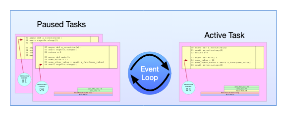

# 1. 概念
1. asyncio 是并发不是并行， 一个 cpu 在某个时刻只能做一件事（多个任务交替执行）， 而多线程或者多进程，是多个 cpu 可以同时做多件事

2. 事件循环

每个线程有一个称为 Event Loop 的对象（现在假设只存在一个），事件循环包含一个名为 Task 的对象列表。每个 Task 都维护一个异步函数的调用堆栈，以及它自己的执行指针。
事件循环又个调度器，负责调度所有的 task（协程）， 在任何时候，事件循环都只能有一个 Task 实际执行（毕竟处理器一次只能做一件事），而循环中的其他 Task 都暂停了。当前正在执行的任务将继续执行，就像在普通（同步）Python 程序中执行函数一样，直到它到达必须等待某些事情发生才能继续的程度。

然后， 调度器调度其他的 task 放在 cpu 上执行， 该 task 先暂停， 并在需要等待的事情发生后在未来的某个时间点再次唤醒它（调度器重新调度它），这样就并发起来了。

这种执行模式，即代码控制在不同任务之间来回移动，每次在它们停止的位置将它们唤醒，这称为“协程调用”，这就是 asyncio 为 Python 编程提供的方法，作为确保 CPU 空闲时间减少的一种方式。
