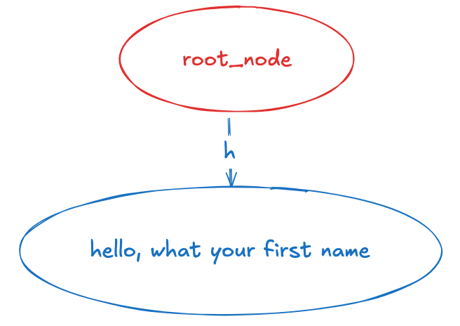
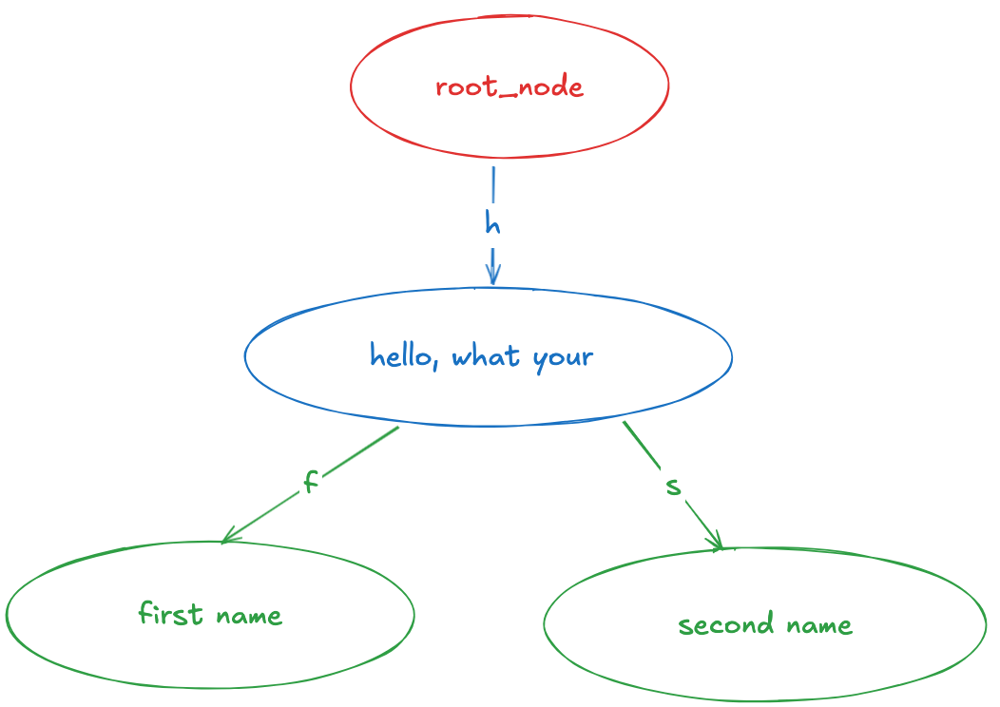
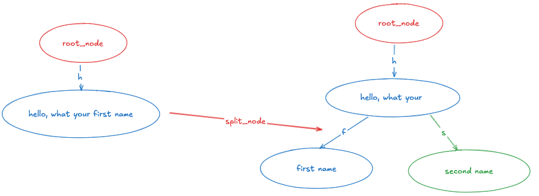
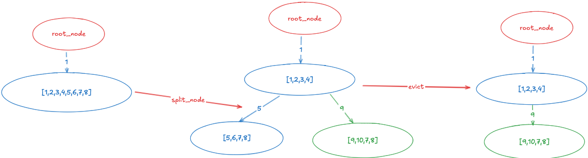
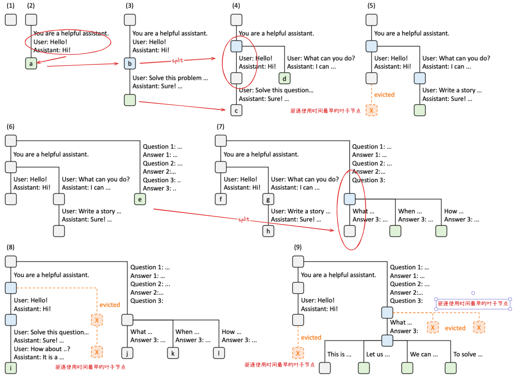

本节主要更详细的探讨 radix-tree 的实现细节， sglang 对应的论文地址 [sglang](https://arxiv.org/pdf/2312.07104)，
对应的测试代码仓库: [测试代码](https://github.com/weishengying/Notes/tree/main/sglang/radix_tree/src)

src 目录中有三个文件，都是从 sglang 中 copy 下来的，方便独立的测试和阅读源码。对应官方 [mem_cache](https://github.com/sgl-project/sglang/tree/main/python/sglang/srt/mem_cache) 目录下，
这里 copy 的是 commit:c996e8ccd415f6e1077ace5bc645d19a8dd40203 中的代码，增加了很多详细的注释，对理解有一些帮助。


# prefix cache

prefix cache 的基本需求就是：把输入的 prompot_token_ids 对应的 kv 值存起来，下次输入类似的 prompot_token_ids 时就直接从 cache 中取出能用的部分，省去一些重复计算。

举个例子：假设第一次输入的 prompt 是 `"hello, what your first name"`，就把这几个 token 的 kv 值存起来，下次输入一个类似的问题如`"hello, what your second name"` 时就直接从 cache 中取出来前面`"hello, what your"`这部分 token 的 kv 值， 只需要计算 `"second name"`这些字符对应 token 的 kv 值。

这个需求更精准的描述就是：**把一些计算过 kv 值的 token 值记录缓存起来，下次输入一个新的 prompt_token_ids 时，尽可能的找到输入 prompt_token_ids 中前 n 个已经被缓存了的 kv 的 token （姑且叫做前向最大匹配），将这部分 token 的 kv 值直接从 kv_pool 中取出来用，然后只需计算出剩余的 token 的 kv 值。**

第一个需要解决的问题就是：如何记录缓存了的 kv 值的 token， 后面输入的 prompt 能够快速高效的查找出其前向最大匹配的 token（这些 token 的 kv 值已经被计算过了）。

第二个问题是：如何分散存储 kv 值, sglang 同样也是使用分散的储存策略（和vllm类似），这里不再赘述。

对于第一个问题，sglang 使用了 radix-tree 来实现, 类似字典树。下面画一些图和一个简单的流程并配合代码注释来说明一下。

**1. 输入 prompt = "hello, what your first name"**

将该 prompot 插入 radix-tree 中（实际是插入这些 prompot 的 token_id 以及这些 token_id 对应的 kv_indices 值）
得到的字典树如下：（使用 pretty_print api 打印出来的结构如下）
```bash
 27 hello, what your first name r=0
#tokens: 27
```


**需要注意 node 子节点的储存方式，是一个map，key 是子节点储存的 token_id 的第一个（对应上图中的 “h”），方便快速匹配查找**

**2. 输入 prompt = "hello, what your second name"**

将第二个输入的 prompot 插入 radix-tree 中
得到的字典树如下：（使用 pretty_print api 打印出来的结构如下）
```bash
 17 hello, what your  r=0
   10 first name r=0
   11 second name r=0
#tokens: 38
```


第二次输入的 prompt 插入 radix-tree 时，节点发了一次 split：


**split 操作的目的：为了后续输入的 prompt 能够尽可能的最大的匹配前面 n 个 token**

对应的代码逻辑如下：
```python
def _insert_helper(self, node: TreeNode, key: List, value):
    node.last_access_time = time.time()
    if len(key) == 0:
        return 0

    if key[0] in node.children.keys(): # 如果待插入的 token_ids 的第一个 token id 在某个 children 节点已经存在
        child = node.children[key[0]] # 获取这个 children 节点
        prefix_len = _key_match(child.key, key) #计算最大的匹配长度

        if prefix_len == len(child.key):  # 如果匹配的长度等于该节点储存的 token_id 长度，则说明该节点已经被完全匹配上，可以继续深入查找
            if prefix_len == len(key): # 待插入的 token_ids 都被匹配上了，则返回匹配的长度（查找结束）
                return prefix_len
            else:
                key = key[prefix_len:] # 继续递归深入查找剩余的未被匹配上的 token_ids
                value = value[prefix_len:]
                return prefix_len + self._insert_helper(child, key, value)

        new_node = self._split_node(child.key, child, prefix_len) # 如果匹配的长度小于该节点储存的 token_id 长度，把该节点 split 掉
        return prefix_len + self._insert_helper( # 然后继续递归搜索
            new_node, key[prefix_len:], value[prefix_len:]
        )

    if len(key): # 否则则创建新的 node， 并将 token ids 和对应的 kv_indices 信息存在到 children 的 key 和 value 中
        new_node = TreeNode()
        new_node.parent = node
        new_node.key = key
        new_node.value = value
        node.children[key[0]] = new_node
        self.evictable_size_ += len(value)
    return 0
```

**3. 当显存不够时，需要剔除一些 token 的 kv 值**

按照 LRU 的策略，剔除最近最少使用的 token 的 kv 值。这部分阅读下面代码就很容易理解：

注意：只能删除叶子节点（叶子结点没有子结点）
```python
def evict(self, num_tokens: int, evict_callback: Callable):
    if self.disable:
        return

    leaves = self._collect_leaves() # 收集所有的叶子节点
    heapq.heapify(leaves) # heapq 是一个堆队列（heap_queue), 将列表 leaves 转换为一个最小堆（就地操作）, node 中定义了 __lt__ 函数，即最后一次被访问时间越早的 node 在堆的上面

    num_evicted = 0
    while num_evicted < num_tokens and len(leaves):
        x = heapq.heappop(leaves) # 从堆中弹出最小的元素

        if x == self.root_node:
            break
        if x.lock_ref > 0: # 表明这个节点存储的 token 的 kv 正在被其他请求使用，不能删除，跳过
            continue

        evict_callback(x.value) # 这里的 evict_callback 函数，往往是来释放 kv_pool 中的 x.value（token_ids) 对应的 kv
        num_evicted += len(x.value)
        self._delete_leaf(x) # 删除该 node 及其所有的child node

        if len(x.parent.children) == 0: # 一些叶子节点被删除后，可能会产生新的叶子节点，收集这些新的叶子节点
            heapq.heappush(leaves, x.parent)
```
按照叶子节点最后一次的访问时间构建一个最小堆，然后从堆中弹出最小的元素，如果该元素被其他请求使用，则跳过，否则释放该元素，并删除该元素（叶子节点）及其所有的。

**4.获取一个 prompt 的前向最大匹配token的 kv 值**

获取一个 prompt 的 kv 值，就是从 radix-tree 中找到前向最大匹配的 token，然后获取 token 对应的 kv_indices 值。
```python
def _match_prefix_helper(
    self, node: TreeNode, key: List, value, last_node: TreeNode
): # 输入 key 是 prompt_token_ids, 该函数的目的是:尽可能的找到输入 prompt_token_ids 中前 n 个已经被缓存了的 kv 的 token （姑且叫做前向最大匹配），
    # 并将前 n 已经被缓存了 kv 的 token 的 kv_indices 添加到 value 中
    node.last_access_time = time.time()
    if len(key) == 0:
        return

    if key[0] in node.children.keys(): # 如果 prompt_token_ids 的第一个 token id 在某个 children 节点已经存在
        child = node.children[key[0]] # 获取这个 children 节点
        prefix_len = _key_match(child.key, key) #计算最大的匹配长度
        if prefix_len < len(child.key): # 如果该节点缓存的 token 长度大于 prompt_token_ids 的长度，则将这个节点进行 split，并返回新的节点
            new_node = self._split_node(child.key, child, prefix_len)
            value.append(new_node.value)
            last_node[0] = new_node
        else:
            value.append(child.value) # 否则即该节点缓存的 token 完全都在输入 prompt_token_ids 中
            last_node[0] = child
            self._match_prefix_helper(child, key[prefix_len:], value, last_node) # 递归继续找 prompt_token_ids 中剩下的部分（key[prefix_len:]）的 token 是否被缓存了 kv
```

最后通过一个 demo 理解一下：
```python
tree = RadixCache(None, None, False)
prompt_token_ids = [1,2,3,4,5,6,7,8] # 假设第一个 prompt 的 token_ids 是 [1,2,3,4,5,6,7,8]
tree.insert(prompt_token_ids)
tree.pretty_print()

prompt_token_ids_2 = [1,2,3,4,9,10,11,12] # 假设第二个 prompt 的 token_ids 是 [1,2,3,4,9,10,11,12]

kv_indices, _ = tree.match_prefix(prompt_token_ids_2) # 获取 prompt_token_ids_2 前向最大匹配的 kv_indices
print(f"\nkv_indices:{kv_indices}\n")

tree.insert(prompt_token_ids_2)
tree.pretty_print()

def evict_callback(x):
    print("evict", x)
    return len(x)

tree.evict(4, evict_callback)
tree.pretty_print()
```
输入如下：
```bash
 8 [1, 2, 3, 4, 5, 6, 7, 8] r=0
#tokens: 8

kv_indices:[[1, 2, 3, 4]]

 4 [1, 2, 3, 4] r=0
   4 [5, 6, 7, 8] r=0
   4 [9, 10, 7, 8] r=0
#tokens: 12

evict [5, 6, 7, 8]

 4 [1, 2, 3, 4] r=0
   4 [9, 10, 7, 8] r=0
#tokens: 8
```
对应的图：


`[5,6,7,8]`这个叶子节点的访问时间更早，所以被删除掉。

最后看看论文里面的图（浅绿色节点表示新插入的节点）：


总结一下：radix-tree 设计的目的就是缓存 prompt cache，整体设计追求的就是两点：快速查找；最大匹配，这也是 split 的原因，更多细节可以查看仓库代码中的代码注释和测试代码。