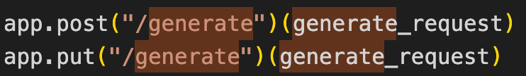
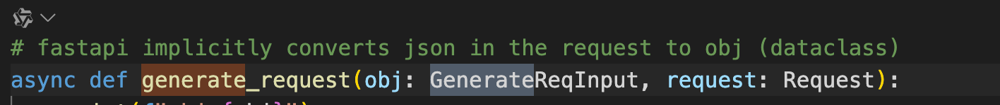
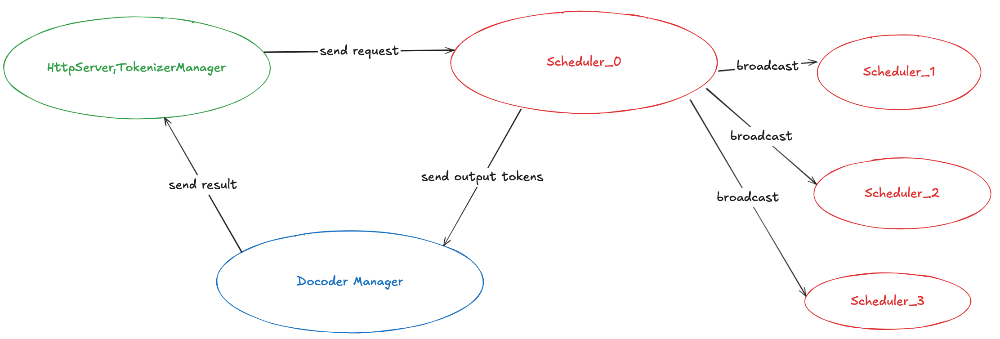

# sglang 分析
[官方仓库](https://github.com/sgl-project/sglang)

## 初步使用
安装
```bash
pip install -e "python[all]"
pip install flashinfer -i https://flashinfer.ai/whl/cu121/torch2.4/
```

启动服务
```bash
python3 -m sglang.launch_server --model-path ${model_path} --mem-fraction-static 0.7 
```

```bash
python -m sglang.launch_server \
       --model-path ${model_path} \
       --port 8000 \
       --mem-fraction-static  0.8 \
       --disable-custom-all-reduce \
       --load-balance-method round_robin \
       --context-length 4096 \
       --tp-size ${tp_size} \
       --enable-mixed-chunk \
       --chunked-prefill-size 512 \ 
       --kv-cache-dtype auto \
       --schedule-policy lpm \
       --dtype  auto \
       --enable-p2p-check
```

发送请求
```bash
curl http://localhost:8000/generate \
  -H "Content-Type: application/json" \
  -d '{
    "text": "What are we having for dinner?",
    "sampling_params": {
      "max_new_tokens": 16
    }
  }'
```

`generate` 请求路径注册了函数 `generate_text`


`generate_text` 函数定义如下:
从源码上看，
FastAPI 会自动将请求体中的 JSON 数据（request）转换为 `GenerateReqInput` 对象。解析的过程就是根据字段的类型和名称来匹配对应的值。因此，请求时传入的参数名称和类型要和 `GenerateReqInput` 定义的类中的字段名称和类型一致。

## salang server 的整体设计
`launch_server` 接口函数注释中描述了服务的顶层设计，主要分为三个进程组：
>* 主进程（The HTTP server and Tokenizer Manager）：Tokenizes the requests and sends them to the scheduler.
>* 模型进程组(Scheduler)：Receives requests from the Tokenizer Manager, schedules batches, forwards them, and sends the output tokens to the Detokenizer Manager.
>* Decoder Manager：Detokenizes the output tokens and sends the result back to the Tokenizer Manager.

进程之间通过 zmq.Context 工具通信， 具体细节可以看 [salang的进程之间的通信](./zmp/readme.md)



## Scheduler

